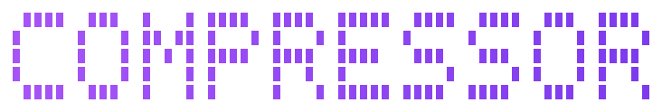

<p align="center">
  
</p>

<p align="center">
  <a href="https://www.npmjs.com/package/@jenssegers/image-compressor"></a>
  <a href="https://github.com/jenssegers/image-compressor/actions/workflows/ci.yml"></a>
  <a href="./LICENSE"></a>
</p>

Compress an image toward a target file size. Give it an image and a size ("give
me a ~200kb jpeg") and it binary-searches the output quality to land near that
size. Powered by [sharp](https://sharp.pixelplumbing.com); ships as a library
and a CLI.

## Install

```sh
npm install @jenssegers/image-compressor
```

Requires Node.js >= 20.9. sharp installs a prebuilt native binary for your
platform automatically.

## Usage

```ts
import { readFile, writeFile } from 'node:fs/promises'
import { compress } from '@jenssegers/image-compressor'

const input = await readFile('photo.png')
const { data, size, quality } = await compress(input, '200kb')

await writeFile('photo.jpg', data)
console.log(`compressed to ${size} bytes at quality ${quality}`)
```

`compress` accepts anything the `sharp()` constructor accepts, so a file path
works too:

```ts
const { data } = await compress('photo.png', 200 * 1024, { format: 'webp' })
```

### API

```ts
function compress(
  input: CompressInput,        // path | Buffer | typed array (same as sharp())
  target: number | string,     // bytes, or "2mb" / "200kb" (binary, 1kb = 1024)
  options?: CompressOptions,
): Promise<CompressResult>
```

`CompressResult` is `{ data: Buffer; size: number; quality: number }`.

| Option        | Type                                   | Default  | Description                                             |
| ------------- | -------------------------------------- | -------- | ------------------------------------------------------- |
| `format`      | `'jpeg' \| 'webp' \| 'avif' \| 'png'`  | `'jpeg'` | Output format.                                          |
| `minQuality`  | `number`                               | `40`     | Lowest quality the search may use (1-100).              |
| `maxQuality`  | `number`                               | `95`     | Highest quality the search may use (1-100).             |
| `maxAttempts` | `number`                               | `6`      | Encode probes before returning the closest result.      |
| `tolerance`   | `number`                               | `0.1`    | Accept a result within this fraction of the target.     |
| `sharp`       | `SharpConstructorOptions`              | -        | Forwarded to `sharp()` (density, pages, failOn, ...).   |

## CLI

```sh
# compress every jpg in ./photos toward 200kb, in place (writes *.compressed.jpg)
npx @jenssegers/image-compressor ./photos/*.jpg -t 200kb

# convert a png to a ~1mb webp in dist/
npx @jenssegers/image-compressor hero.png -t 1mb -f webp -o dist/
```

```
Options
  -t, --target <size>    Target size, e.g. 200kb, 1.5mb (required)
  -f, --format <fmt>     Output format: jpeg | webp | avif | png (default: jpeg)
  -o, --out <dir>        Output directory (default: alongside each source as
                         <name>.compressed.<ext>)
  -h, --help             Show help
  -v, --version          Show the version
```

## How it works

There is no way to ask an encoder for an exact file size, so `compress`
binary-searches the quality range: it encodes, compares the byte size to the
target, and narrows the range until a result lands within `tolerance` (or
`maxAttempts` is reached). If the input already sits under the target in the
requested format, it is kept at top quality. If the target cannot be reached
within the quality range, the closest result found is returned rather than
throwing, so you always get a usable image.

## License

[MIT](./LICENSE) (c) Jens Segers
